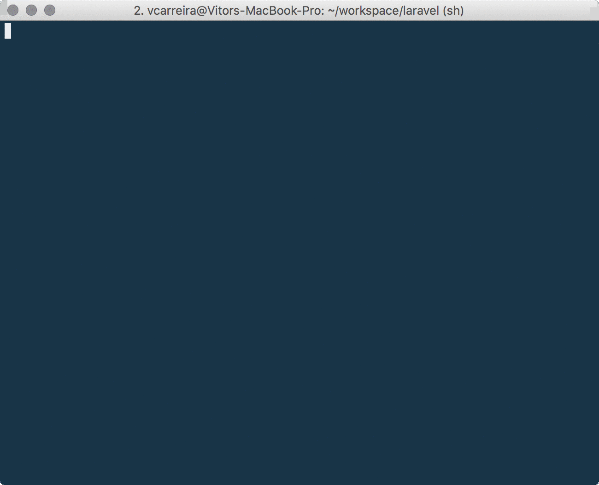

# generator-docker-laravel [![NPM version][npm-image]][npm-url] [![Build Status][travis-image]][travis-url] [![Dependency Status][daviddm-image]][daviddm-url] [![Coverage percentage][coveralls-image]][coveralls-url]
> Docker compose generator for a full Laravel setup

## Installation

First, install [Yeoman](http://yeoman.io) and generator-docker-laravel using [npm](https://www.npmjs.com/) (we assume you have pre-installed [node.js](https://nodejs.org/)).

```bash
npm install -g yo
npm install -g generator-docker-laravel
```

Then generate your new project:

```bash
yo docker-laravel
```

This generator creates a docker-compose file (`docker-compose.yml`) and scripts (`dc-aliases` and `update-notifications-service.sh`) that helps you build and run a full Laravel project inside a set of docker containers. You choose which containers are created. At the moment the following containers are available:
 - NGINX container with FPM PHP 7.1 (mandatory)
 - Database container (for the moment only MySQL is supported) (mandatory)
 - Queue daemon used to run artisan queue command (includes a Redis container)
 - Notifications daemon used to broadcast events using Socket.io (includes a Redis container)
 - Adminer

### Quick demo


## Longer walkthrough videos

[![01. Basic walkthrough][video1thumb]][video1]

[![02. Using adminer][video2thumb]][video2]

[![03. The queue daemon][video3thumb]][video3]

[![04. The notifications daemon][video4thumb]][video4]

[![05. Managing containers][video5thumb]][video5]


## Getting Started
Once generator-docker-laravel is installed go to your Laravel project folder, open a bash or powershell window
```bash
yo docker-laravel
```
- Answer the prompts, and select which containers you want to setup
- Based on your options, the following files will be created:
 - `docker-compose.yml`: the docker compose file where all services are defined
 - `dc-aliases`: a set of aliases to help manage the docker containers
 - `update-notifications-service.sh`: script to recreate the NodeJS notifications daemon (when the code is changed the daemon should be updated)
 - `nodejs-apps` folder where the NodeJS notifications daemon sample app is stored
- Enter: `source dc-aliases` to import the docker-compose alias into your terminal's session. Optionally you can copy them permanently to your shell's configuration file


## Launching the containers
To launch the service containers just type:

```
dc-up
```

To stop and remove all containers type:

```
dc-down
```

## Daily usage

To run common tasks use the following aliases:

 - ```dc-art``` or ```dc-artisan``` - to run artisan (e.g. ```dc-art migrate```)
 - ```dc-phpunit``` - to run phpunit (e.g. ```dc-phpunit tests```)
 - ```dc-phpspec``` - to run phpspec


The following aliases are provided for additional maintenance:

 - ```dc-adminer``` - to launch the adminer container
 - ```dc-clear-generated``` - to remove all generated images (all service containers must be stopped before running this command)

**Important notes:**
  - Version 1.7 or greater of ```docker-compose``` is required because the Compose file reads environment variables from the Laravel .env file
  - [Composer CLI](https://getcomposer.org/)  must be installed to manage Laravel's package dependencies (the generator does not create a composer container)
  - This generator is an improvement of my [first approach](https://github.com/vcarreira/docker-laravel) to dockerize a Laravel project

## License

Apache-2.0 © [Vitor Carreira]()


[npm-image]: https://badge.fury.io/js/generator-docker-laravel.svg
[npm-url]: https://npmjs.org/package/generator-docker-laravel
[travis-image]: https://travis-ci.org/vcarreira/generator-docker-laravel.svg?branch=master
[travis-url]: https://travis-ci.org/vcarreira/generator-docker-laravel
[daviddm-image]: https://david-dm.org/vcarreira/generator-docker-laravel.svg?theme=shields.io
[daviddm-url]: https://david-dm.org/vcarreira/generator-docker-laravel
[coveralls-image]: https://coveralls.io/repos/vcarreira/generator-docker-laravel/badge.svg
[coveralls-url]: https://coveralls.io/r/vcarreira/generator-docker-laravel
[video1thumb]: https://img.youtube.com/vi/W7XikYGS184/0.jpg
[video2thumb]: https://img.youtube.com/vi/LPrYJEIorfA/0.jpg
[video3thumb]: https://img.youtube.com/vi/J7Oxxi1j4dM/0.jpg
[video4thumb]: https://img.youtube.com/vi/hWwaBt5PP1g/0.jpg
[video5thumb]: https://img.youtube.com/vi/vW603HViLK8/0.jpg
[video1]: https://www.youtube.com/watch?v=W7XikYGS184&index=1&list=PLjwN1bRa3OvYMXX9-xSogHm7DZg-xkPtq
[video2]: https://www.youtube.com/watch?v=W7XikYGS184&index=2&list=PLjwN1bRa3OvYMXX9-xSogHm7DZg-xkPtq
[video3]: https://www.youtube.com/watch?v=W7XikYGS184&index=3&list=PLjwN1bRa3OvYMXX9-xSogHm7DZg-xkPtq
[video4]: https://www.youtube.com/watch?v=W7XikYGS184&index=4&list=PLjwN1bRa3OvYMXX9-xSogHm7DZg-xkPtq
[video5]: https://www.youtube.com/watch?v=W7XikYGS184&index=5&list=PLjwN1bRa3OvYMXX9-xSogHm7DZg-xkPtq

